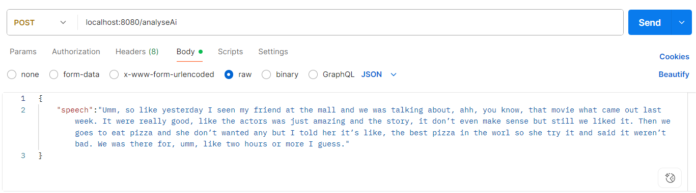
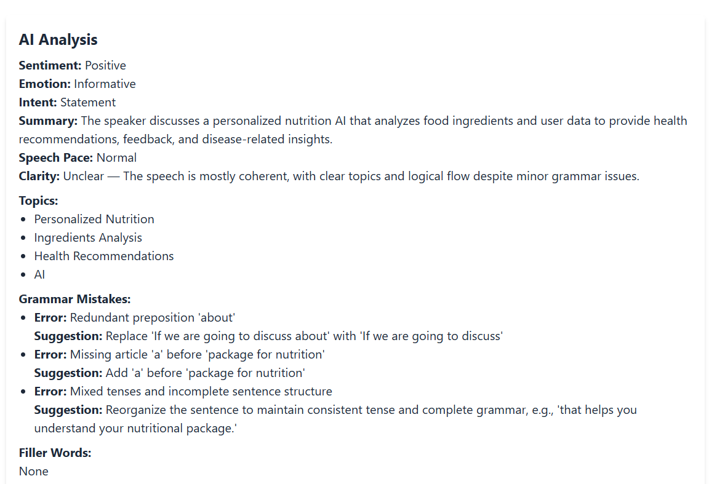

# SpeakWise – Backend

SpeakWise backend powers the speech analysis features of the application. It is built with **Java Spring Boot** and exposes RESTful APIs to handle speech data, perform analysis, and send results back to the frontend.

---

## ✨ Features

- RESTful APIs for speech data analysis  
- Sentiment, emotion, and clarity detection  
- Grammar and filler words identification  
- JSON-based responses to the frontend  
- Secure, scalable, and modular architecture  

---

## 🛠️ Tech Stack

- **Java 21+**  
- **Spring Boot** (REST API, MVC)  
- **Spring Web**  
- **Gradle** build system  

---
## 🖼️ Screenshots

### Hero Section 1  





---

## 🚀 Getting Started

1. Clone the repository:
   ```bash
   git clone https://github.com/Aaliyakhan10/SpeakWise-backend
   cd speakwise-backend
   
2. Build the project
3. Run the application.
4. The backend runs at
